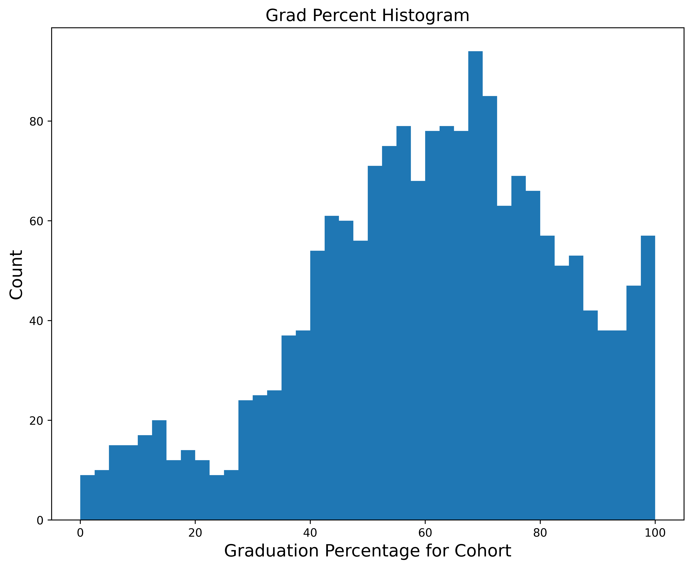
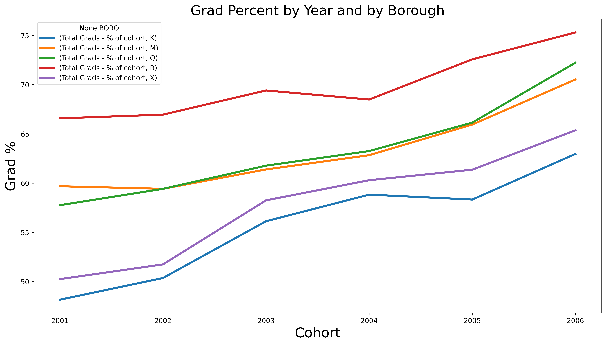
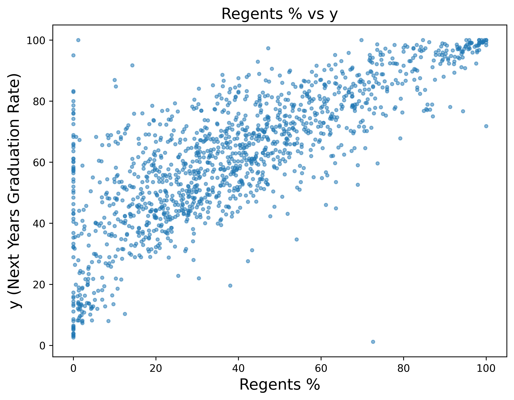
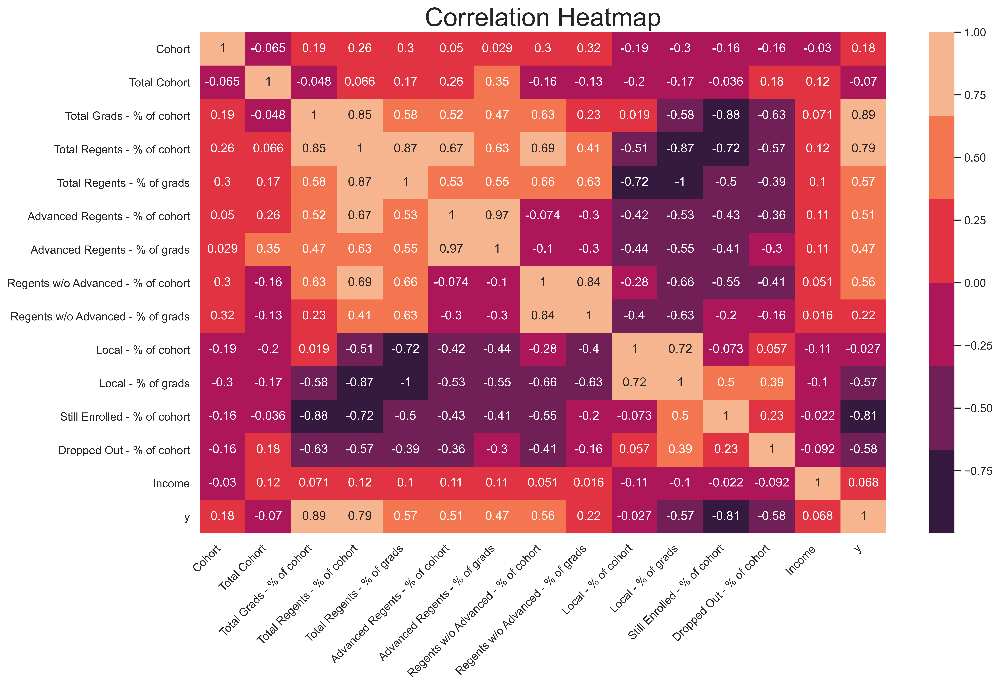
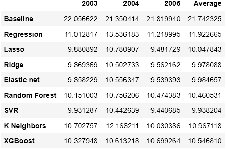
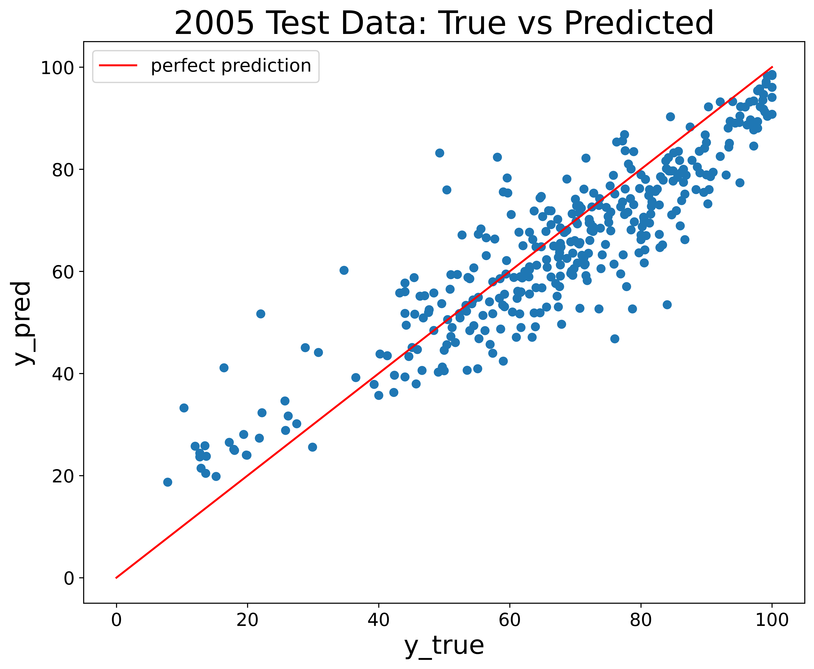
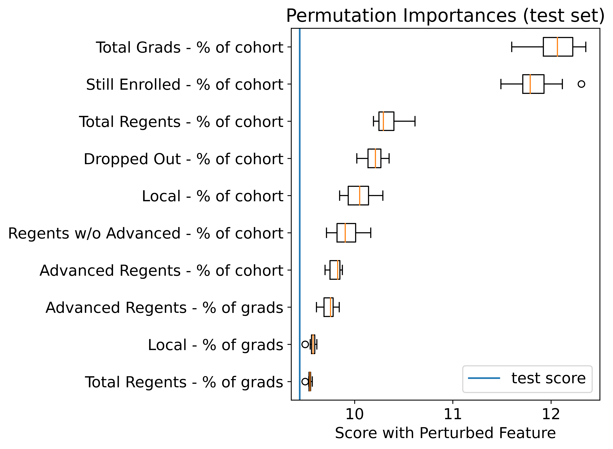

# Forecasting NYC Public School Graduation Rates
### Project Overview
For this project we use the “2005-2010 Graduation Outcomes - School Level" dataset from NYC OpenData to build a model which predicts graduation outcomes for each subsequent year.  This model could be very useful for resource allocation purposes for the city.  In the src directory there are four notebooks- "data_cleaning_&_preprocessing", "EDA", "model_training & splitting" and "grad % project_master".  For a detailed report on the project and breakdown of the notebooks please see the report folder.  

### Language, Packages and Data
**Language:**  Python verion 3.7.8    
**Packages:** numpy version 1.18.5, matplotlib version 3.2.2, sklearn 0.23.1, pandas version 1.0.5, xgboost 1.1.1  
**Data:** https://data.cityofnewyork.us/Education/2005-2010-Graduation-Outcomes-School-Level/vh2h-md7a  

### Selections from EDA and model_building Notebooks
Below are a few selections from EDA, a chart of performances of each model tested and some plots relating to the performance of our best model.  
  
###  
The target variable has a mean of ~ 60.99 and standard deviation of ~ 22.39  
###  
  

The target variable is non-stationary with mean steadily increasing for each borough for each year with the exception of Staten Island(2003-2004), Manhattan(2001-2002) and Brooklyn(2004-2005).  

  

One of the most predictive variables was the percent of students who passed the Regents Standardized Exam for the previous year.  The correlation was .79.  

  

The heatmap shows the correlations between all variables in the model.  The strongest positive correlations with the graduation rate in year i+1 were the percent of graduates in year i and the percent who passed the regents in year i.  The strongest negative correlations with graduation rate for year i+1 were the percent of students still enrolled after year i and dropout percent for year i.  

  

Above the performance of all models can be seen.  The best model was SVM on the test data for 2005 with hyperparameters: kernel='rbf', gamma=0.0001220703125 and C=128  

  

The performance of this model is fairly strong, however it seems to frequently slightly underpredict, likely due to the fact that, as mentioned above, there is a steady increase in the target variable for each year.  

  

The percent of students who graduated in the previous year, percent of students who are still enrolled and the percent of students who passed the Regents exam were the first, second and third most significant variables respectively  
